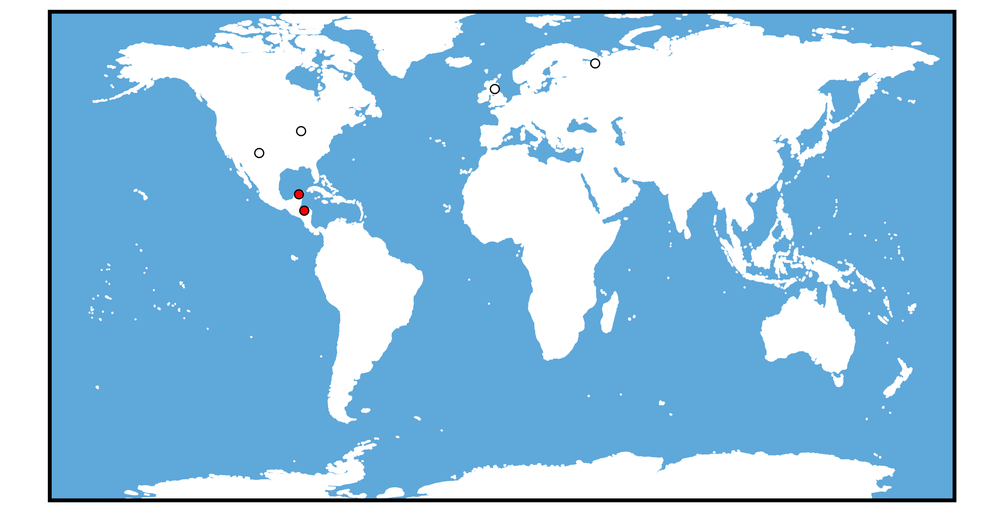
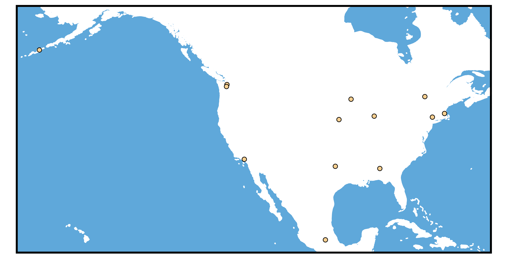

# Locations in The Dresden Files

## Getting location data
I had a ton of fun clicking around this [interactive map](https://www.google.com/maps/d/u/0/viewer?mid=1EVEViVHIuS8nXzhz66b7rEwwRqo&hl=en_US&ll=41.88792118153663%2C-87.69842410058595&z=9
) of The Dresden Files locations. I wanted to expand on it by including more locations and adding metadata onto the locations. I've grabbed many of the locations from this map, those curated on two pages on The Dresden Files Wiki [all locations](http://dresdenfiles.wikia.com/wiki/Category:Locations?display=page&sort=mostvisited) and [just Chicago](http://dresdenfiles.wikia.com/wiki/Chicago), then finally added a few of my own for a total of 60 locations. I excluded most of the invented locations for which there is little to no description of the approximate location such as Harry's office and  McAnally's Pub, but I included locations with fuller descriptions such as the Carpenter's home near Wrigely Field and Thomas Raith's apartment in the Gold Coast area.    

Once I had the names of locations (ex: "Shedd Aquarium, Chicago") I used the package ggmap to obtain latitude and longitude information. 

#### Obtaining latitude and longitude with ggmap

I learned to create maps using a helpful [tutorial](https://eriqande.github.io/rep-res-web/lectures/making-maps-with-R.html) and to make animations using the vignette for the package [magick](https://cran.r-project.org/web/packages/magick/vignettes/intro.html).

Importantly, since Eric's tutorial was written an update to Google's Maps Platform now meads that `ggmap::geocode` requires that you have an API key from Google. I went to this [registration page](https://cloud.google.com/maps-platform/#get-started) to sign up for an API key. I "Enabled Google Maps Platform" by following the on screen wizard (selected Maps, generated a project name, and gave billing info). Linking a credit card was less than ideal, so if you have other mapping tools that you prefer please let me know about them! Once I signed up for the Google Maps Platform account, I navigated to APIs & Services and then Credentials. I clicked "Create Credentials" > "API Key." In doing so I was able to generate an API key, which is a string of alphanumeric gobbledegook. 

Back in R, here's how you use your API key and then __finally__ get to search for latitude and longitude. 

```
install.packages("ggpmap")
library(ggmap)
register_google(key = "paste_your_API_key_here")
geocode("Chicago, Illinois")
# A tibble: 1 x 2
    lon   lat
  <dbl> <dbl>
1 -87.6  41.9
```

Now that we can get locations, we can get to plotting on maps! 


I cleaned up my data into a tibble and added some information about the book in which the location first appears and if there is a character or group particularly associated with the location.

## Plotting the locations by their order of appearance  
     
First I plotted as many of the Chicago locations from Books 1-15 + *Side Jobs* + *Brief Cases* that I could assemble. Each image in the animation adds locations from each book, sequentially. We can see how much more rich the Chicago environment beomes with each new adventure.  
 

## Red Court vs. White Council  
I've recently been listening to the audiobook for Changes so the war between the Red Court and the White Counil is fresh in my mind. Here I have some of their relevant locations by faction. White Council locations include HQ in Edinborough, Camp Kaboom, and Archangel. For the Red Court I focused on just Chichen Itza and Casaverde; we're told they control much of South America but without any specifics listed in the novels I'll leave that to your imagination.    
 

## Paranet  
Finally, I've compiled all of the Paranet locations explicitly listed. For locations where only a state or country was mentioned rather than a specific city I simply assigned the location to the relevant capital. The Paranet is such a wonderful concept and I love everytime we get to meet new Netters. Hopefully. we get to hear about some more of the global paranet locations in the future. Where do you think will be next?  
 

Be sure to let me know about all of the locations I have forgotten to include. 

