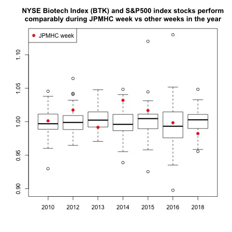

## Healthcare fortunes at stake during conference 

The J. P. Morgan Healthcare Conference (JPMHC) is an annual get together of pharma and biotech bigwigs in San Francisco. It's considered common knowledge that stocks change in response to the speeches, deals, and data presented at the meeting. One [article said that](https://www.cnbc.com/2017/01/04/betting-on-biotech-during-jpmorgans-big-health-care-conference-pays-off-history-shows.html):

* "Biotech has historically outperformed the broader market during The J.P. Morgan Healthcare Conference" and  
* "in the past 16 years, the NYSE Arca Biotechnology index (BTK), which measures the performance of 30 biotechnology firms, has outperformed the S&P 500 index by nearly 3 percent during JPMorgan's conference."

Given these claims I hypothesized that:

1. Healthcare stock prices tend to fluctuate more during JPM week than any other week in the same year.
2. The biotech sector outperforms the S&P 500 during JPM week more often than is expected by chance.

## Healthcare stock price fluctuatations during JPMHC week are fairly average  

I downloaded all of the NASDAQ and NYSE stock tickers and subset them to only include "Health Care" sector companies. For each of these healthcare stocks I downloaded historical prices from 1983 - 2017. Then I calculated the range in price for every week (maximum price minus minimum price) for each healthcare stock. I tabulated the number of weeks per year when the price range for the stock was smaller than price range the week of JPMHC. 
  

  
Stock prices suprising fluctuated less than during JPMHC week <50% of the year between 1983 - 2013. It's only been in the last few years that JPMHC week healthcare stock fluctuations have become larger compared to the rest of the year, plausibly due to the increasing size and coverage of the conference.

## The biotech sector does not outperform the S&P 500 during JPMHC week more than the rest of the year
I downloaded historical stock prices for three indices: NYSE Biotech ("BTK"), NASDAQ Biotech ("NBI"), and S&P500 ("SPY"). For each week in the year I calculated the raw performance of each index by dividing the week's closing price by the opening price. I calculated the relative performance of the S&P500 versus the biotech indices by dividing the biotech index performance by the S&P500 index performance. 
 

Although the relative performance of biotech during JPMHC week is sometimes higher than the S&P500, this ratio is not consistently higher than what is observed the rest of the year.  

## Common knowledge says this conference impacts healthcare stocks, but it doesn't really 
My analysis of the stock data contradicts my intution that was built upon the prevailing sentiment regarding the affect of JPMHC week on biotech stocks. The two hypotheses motivating this analysis have been overturned:  

1. ~~Healthcare stock prices tend to fluctuate more during JPM week than any other week in the same year.~~Definitely not.  
2. ~~The biotech sector outperforms the S&P 500 during JPM week more often than is expected by chance.~~ Not true. 

The analysis presented can be found in this [**RMarkdown**](https://github.com/katiesaund/JPM_Healthcare_2019/blob/master/2019-05-27_JPM_week.Rmd) and the data files can be downloaded from the [**git repo**](https://github.com/katiesaund/JPM_Healthcare_2019/blob/master/).
