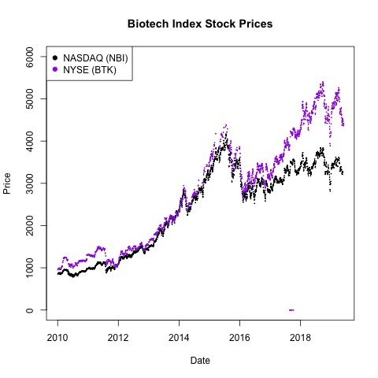

## Common knowledge says this conference impacts healthcare stocks, but it doesn't really 

The J. P. Morgan Healthcare Conference (JPMHC) is an annual get together of pharma and biotech bigwigs in San Francisco. During JPMHC week 2019 (#JPMHC2019) I read that this behemoth of a meeting has a strong influence on the stock prices of companies in the sector. It's considered common knowledge that stocks change in response to the speeches, deals, and data presented at the meeting. One [article said that](https://www.cnbc.com/2017/01/04/betting-on-biotech-during-jpmorgans-big-health-care-conference-pays-off-history-shows.html):

* "Biotech has historically outperformed the broader market during The J.P. Morgan Healthcare Conference" and  
* "In the past 16 years, the NYSE Arca Biotechnology index (BTK), which measures the performance of 30 biotechnology firms, has outperformed the S&P 500 index by nearly 3 percent during JPMorgan's conference"

Given these claims I hypothesized that:

1. Healthcare stock prices tend to fluctuate more during JPM week than any other week in the same year.
2. The biotech sector outperforms the S&P 500 during JPM week more often than is expected by chance.

## Healthcare stock price fluctuatations during JPM week are fairly average (half of the year the fluctuations are larger)  

I downloaded all of the NASDAQ and NYSE stock tickers and subset them to only include "Health Care" sector companies. For each of these healthcare stocks I downloaded historical prices from 1983 - 2017. Then I calculated the range in price for every week (maximum price minus minimum price) for each healthcare stock. I tabulated the number of weeks per year when the price range for the stock was smaller than price range the week of JPMHC. 
  

  
This isn't at all what I was expecting. The fluctuations in stock price during JPMHC week slightly below average from 1983 - 2013. It's only been in the last few years that JPMHC week healthcare stock fluctuations have become larger compared to the rest of the year, plausibly due to the increasing size and coverage of the conference.  

## The biotech sector does not outperform the S&P 500 during JPM week more than the rest of the year
I downloaded historical stock prices for three indices: NYSE Biotech ("BTK"), NASDAQ Biotech ("NBI"), and S&P500 ("SPY") from 2010-2018, which is a date range with data from all three indices.  

The two biotech index stocks behave similarly over the date range.

For each week in the year I got the performance of each index by calculating the index's weekly closing price by the weekly opening price. Then I found the relative performance of the S&P500 versus the biotech indices by diving the biotech index performance by the S&P500 index performance. Below I plotted this metric of relative performance by year. I've highlighted JPMHC week in red. Though the relative performance of the biotech index during JPMHC week is sometimes higher than the S&P500 index, it's clearly nothing special (and not statistically significantly different).  
 

## My Conclusions: If JPMHC affects biotech stocks, its within the noise of the market. 
My analysis of the stock data contradicts my intution that was built upon the prevailing sentiment regarding the affect of JPMHC week on biotech stocks. As with most of my analyses, I'm left with more questions: what assumptions are baked into my methods and how should I validate them? I made some simplifcations for this analysis, were they jusitified? Do I need to redefine stock flucation and performance? How did my approach differ from the article that inspired me? 

The analysis presented can be found in this [**RMarkdown**](https://github.com/katiesaund/JPM_Healthcare_2019/blob/master/2019-05-27_JPM_week.Rmd) and the data files can be downloaded from the [**git repo**](https://github.com/katiesaund/JPM_Healthcare_2019/blob/master/).
